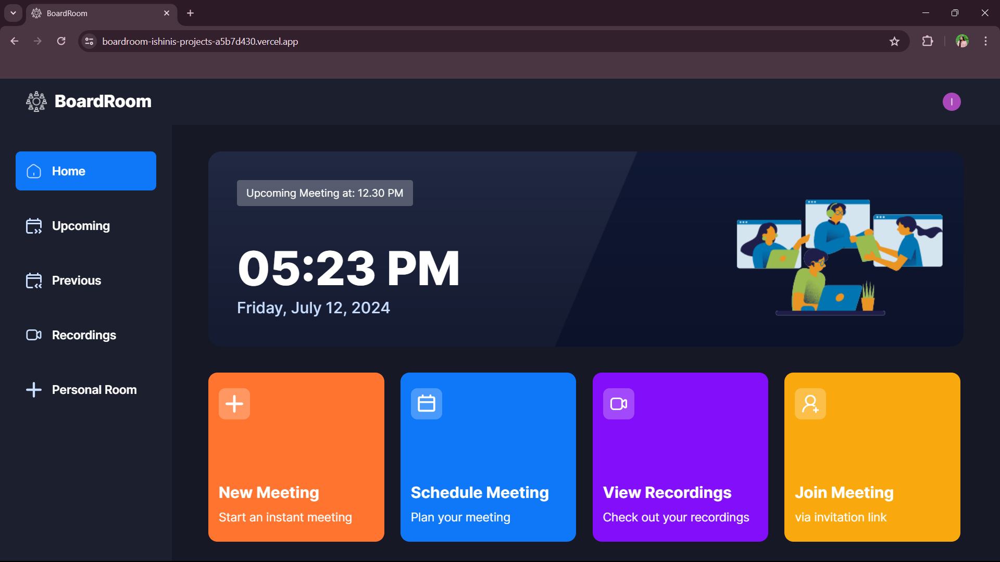

 
<h1> BoardRoom - Virtual Conference Application </h1>
<!--  -->
  
  

BoardRoom is a professional enterprise-ready video conferencing application built using Next.js 14, Stream, and Tailwind CSS. It provides a robust platform for seamless video communication, catering to enterprise needs with advanced features and a user-friendly interface.

### BoardRoom Live : https://boardroom-ishinis-projects-a5b7d430.vercel.app

## Features

- **High-Quality Video Conferencing**: Utilize Stream for high-definition video and audio quality.
  
- **Responsive Design**: Fully responsive interface built with Tailwind CSS, ensuring a smooth experience across all devices.
  
- **User Authentication**: Secure user authentication with Clerk.
  
- **Meeting Management**: Schedule, join, and manage meetings with ease.
  
- **Recording and Playback**: Record meetings and play them back at your convenience.
  
- **Device Settings**: Customize your video and audio settings before joining a call.
  
- **Upcoming and Previous Meetings**: View and manage your scheduled and past meetings.
  
- **Cross-Browser Support**: Compatible with all modern web browsers.

## Tech Stack

- **Framework:** Next.js 14
- **Streaming:** Stream
- **Styling:** Tailwind CSS / shadcn
- **Authentication:** Clerk
- **Language:** TypeScript
- **Runtime:** Node.js

